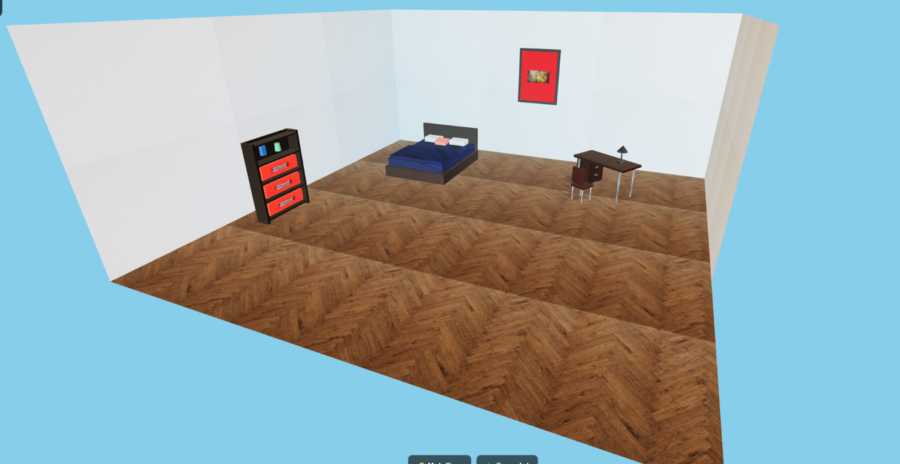

# 🏠 Simulasi Kamar Tidur 3D

Simulasi ruangan 3D interaktif (Kamar Tidur) menggunakan **React Three Fiber** dan **TypeScript**.



## ✨ Fitur

- 🎮 **Kontrol Kamera 360°** - Putar, zoom, dan jelajahi ruangan dari segala sudut
- 🌙 **Mode Siang/Malam** - Toggle untuk mengubah suasana pencahayaan
- 📸 **Screenshot** - Simpan tampilan 3D sebagai gambar PNG
- 🎛️ **Panel Kontrol (Leva)** - Adjust intensitas cahaya secara real-time
- 💡 **Lampu Meja Interaktif** - Menyala saat mode malam aktif
- 🖼️ **Tekstur Realistis** - Lantai kayu, dinding, furniture dengan tekstur HD

## 🛠️ Tech Stack

- **React 18** + **TypeScript**
- **Vite** - Build tool & dev server
- **Three.js** - 3D rendering engine
- **React Three Fiber** - React renderer untuk Three.js
- **@react-three/drei** - Helper components
- **Leva** - GUI controls

## 📦 Instalasi

```bash
# Clone repository
git clone https://github.com/username/3d-room-react.git
cd 3d-room-react

# Install dependencies
npm install

# Jalankan development server
npm run dev
```

Buka browser ke `http://localhost:3000`

## 🎯 Penggunaan

| Aksi | Cara |
|------|------|
| Putar kamera | Klik & drag mouse |
| Zoom | Scroll mouse |
| Mode Siang/Malam | Klik tombol "Mode Siang/Malam" |
| Screenshot | Klik tombol "Screenshot" |
| Adjust lighting | Buka panel Leva (kanan atas) |

## 📁 Struktur Project

```
3d-room-react/
├── public/
│   ├── floor_texture.jpg
│   ├── wall_texture.jpg
│   ├── wood_furniture_texture.jpg
│   ├── bed_fabric_texture.jpg
│   ├── pillow_texture.jpg
│   ├── metal_texture.jpg
│   ├── books_texture.jpg
│   └── poster_image.jpg
├── src/
│   ├── components/
│   │   ├── Scene.tsx          # Main 3D scene
│   │   ├── LoadingScreen.tsx
│   │   └── furniture/
│   │       ├── Bed.tsx
│   │       ├── Desk.tsx
│   │       ├── Bookshelf.tsx
│   │       ├── TableLamp.tsx
│   │       └── Poster.tsx
│   ├── App.tsx
│   ├── main.tsx
│   └── index.css
├── index.html
├── package.json
├── tsconfig.json
└── vite.config.ts
```

## 🎨 Transformasi 3D

Kode menggunakan komentar khusus untuk dokumentasi transformasi:
- `// TRANSLASI` - Perubahan posisi objek
- `// ROTASI` - Perubahan orientasi objek  
- `// SKALA` - Perubahan ukuran objek

## 📝 Scripts

```bash
npm run dev      # Development server
npm run build    # Production build
npm run preview  # Preview production build
```

## 👤 Author

**[Nama Anda]**
- NIM: [NIM Anda]
- Mata Kuliah: Grafika Komputer

## 📄 License

MIT License - Bebas digunakan untuk keperluan akademik.
